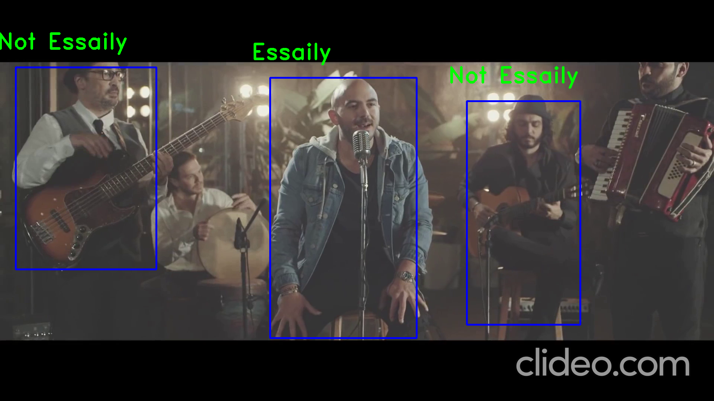

# Overview

This repository contains image data collected from a certain video (I have taken screenshots from this video) to be trained on a CNN model, this data includes 2 classes, first class is called "Essaily" and second class called "not Essaily". I have used the SSD mobile-net object detection model to detect all persons in the image and the result will be an image contains many persons that bounded by a box and the CNN model decide which of them is "Essaily" and which "not Essaily".

# Steps

1. Generate the dataset by taking screenshots from a video and creating the 2 classes directory.

2. Load the dataset in the ipynb file and making label column.

3. Split the data into train and test data.

4. Apply data augmentation on our training data.

5. Build a CNN model for classification.

6. Download Tensorflow object detection repository from [here](https://github.com/tensorflow/models).

7. Download SSD (Single Shot Detector) mobile-net-v1 pre-trained model from [here](http://download.tensorflow.org/models/object_detection/ssd_mobilenet_v1_coco_2018_01_28.tar.gz).

8. Testing the model by loading the video in the SSD model to detect the persons in it and then classify them by the CNN model.

